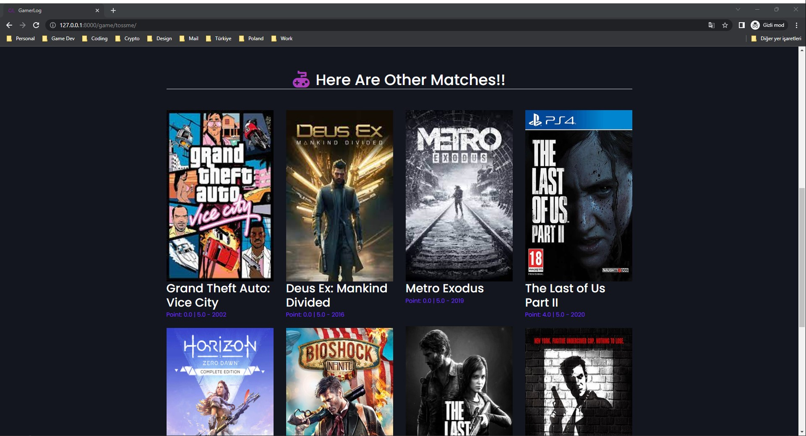

# GamerLog
Final Project of Dogus Unıversity Computer Engineering
<br>
- Dogus University

- Teacher referance: <a href="https://www.dogus.edu.tr/akademik-kadro/muhendislik-fakultesi/muysal">Mitat Uysal</a>

## Group Members
- <a href="https://kenanege.com/">Kenan EGE</a>
- <a href="https://barisbali.com/">Barış BALİ</a>
- <a href="">Engin Deniz GÜN</a>
- <a href="">Eren Niyazi DUMLUPINAR</a>
- <a href="">Mustafa DİNDAR</a>

## About Project
<p>Finding a suitable game for a video game lover's tastes and creating a "visual" game library is still a huge problem today. Due to satisfy needs of this "video game lover's" we designed a project that aims to create a platform where users can create their own game collection on their own profiles. In this platform users can create collections of the games they liked and played, make comments and ratings on them. Will be useful because there are not many platforms like this in the market. The biggest plus of this platform is by looking at the user's collection of games and own ratings and their reviews, an AI recommendation system will make them more comfortable when buying new games by suggesting the games they may like next.</p>
<p>To achieve this goal, we integrated a video game recommendation system within the Django-based website. The system utilizes the Surprise library and popular algorithms to recommend games that are similar to those that a user has previously liked. By clicking the button labeled "Toss Me a Game" on the user's profile, the system will provide personalized game suggestions based on the user's game collection, ratings, and reviews. This feature enhances the user experience by providing personalized game recommendations and making the process of finding new games more comfortable for the user.</p>
<p>Moreover, this platform is unique in the market as it allows users to create their own game collections on their profiles, make comments and ratings on them, and share them with other users. This feature allows users to not only keep track of their own game collection but also, in the future they will discover new games through other users' collections. Additionally, the platform has a social aspect where users can connect with other players and share their thoughts on games.</p>
<p>In summary, our project aims to create a platform where users can create their own game collections on their own profiles and an AI recommendation system that suggests games they may like next. With the integration of the Surprise library and recommendation algorithms, the platform provides personalized game recommendations, making the process of finding new games more comfortable for the user, and the unique feature of creating and sharing game collections with other users sets it apart from other platforms in the market.</p>

### Keywords: 
* Game discovery
* Game library
* Game lover's taste
* AI recommendation system
* Personalized game recommendations
* Game collection management
* User experience


### Tech stack is following
1. Back-end: Django
2. Front-end: Vanilla Html Css, Bootstrap 5
3. Database: SQL Lite 3

### How Project Looks

<br><b>Some Screenshots</b>
	
Screenshots           |  Screenshots 
:-------------------------:|:-------------------------:
  |  
  |  
  |  
  |  
<br>

### Kanban Board ( To Do / In Progress / Done )

To Do:
* Lorem ipsum dolor sit amet. In volu
* Lorem ipsum dolor sit amet. In volu.
* ILorem ipsum dolor sit amet. In volu

In Progress:
* Lorem ipsum dolor sit amet. In volu
  * Lorem ipsum dolor sit amet. In volu

Done:
* User can register an account
* User can register an account
* User can like games
* User can add games to library
* User can recommend new game 


### Uml Diagram:


### How To Open Project At First:
```bash
    C:\Users\Eren\Desktop\(github projesinin içinde olduğu bir üst klasör)>py -m venv klasöradı
    C:\Users\Eren\Desktop\(github projesinin içinde olduğu bir üst klasör)>klasöradı\Scripts\activate.bat
    (klasöradı) C:\Users\Eren\Desktop\(github projesinin içinde olduğu bir üst klasör)>py -m pip install Django
    (klasöradı) C:\Users\Eren\Desktop\(github projesinin içinde olduğu bir üst klasör)>GamerLog_DjangoProject-main\GamerLog>python -m pip install whitenoise==6.0.0
    (klasöradı) C:\Users\Eren\Desktop\(github projesinin içinde olduğu bir üst klasör)>GamerLog_DjangoProject-main\GamerLog>python -m pip install Pillow
    (klasöradı) C:\Users\Eren\Desktop\(github projesinin içinde olduğu bir üst klasör)>GamerLog_DjangoProject-main\GamerLog>py manage.py runserver
```


